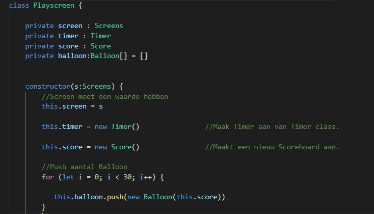

# Inleverdocument CMTTHE01-4 - GAME

Dit is de game die ik gemaakt heb voor het vak Programmeren van Periode 4, leerjaar 1

## Speelbare game

Link naar de online speelbare game. X

## Checklist

- [x] De game heeft een startscherm en een eindscherm.
- [x] Er zijn geen bugs.

## Toelichting OOP 

 - **Classes**
   - *Waarom toegepast?*
   
    Een "Class" is een uitrekbaar programmeer-code-template voor het creeeren van objecten. In classes worden beginwaardes gecreeerd die de status van het object aangeven. Ook kun je in een class implementaties van het gedrag van het object aangeven. 
   
      Mijn hele document staat vol met classes. Ik gebruik classes om functies die met het object te maken hebben te bewaren. De functies die ik dan in een bepaalde class heb gemaakt roep ik dan via een andere class aan, door dit te doen zijn al mijn classes met elkaar verbonden. 
      
   - *Waar toegepast?*
   
    Één van mijn meest grootste voorbeelden van waar ik classes heb toegepast is "playscreen.ts" waar een onderdeel ervan hieronder te zien is. In dit onderdeel heb ik de classes "Timer", "Screen", "Score" & "Balloon" opgeroepen in de class Playscreen. Ik heb al deze classes verbonden met een variabele zodat ik de classes kan oproepen en gebruiken in de constructor. 

    

 - **Encapsulation**
   - *Waarom toegepast?*
   
   Encapsulation is het op protected, private of public zetten van properties & functies. Je zet ze op public als je wilt dat andere bestanden ook toegang hebben tot je variabelen. Wanneer variabelen op public staan kunnen andere bestanden de waardes ervan aanpassen. Hierom is het het handigst om zoveel mogelijk variabelen op "private" te zetten, aangezien je daardoor meer controle hebt over je code omdat je het alleen maar op bepaalde plekken kan aanpassen. 
   
   Protected daarintegen gebruik je alléen als je wilt dat je "children" je code kunnen aanpassen & de rest niet.
   
   
   - *Waar toegepast?*
   
   Encapsulation is in al mijn dev bestanden gebruikt. Als voorbeeld geef ik hierom alweer de playscreen.ts;
   
     
   
 - **Composition**
   - *Waarom toegepast?*
   
     Composition is handig om te gebruiken wanneer je alle Classes in je document met elkaar wilt verbinden. Ook is het handig om compositie te gebruiken als je via 1 class een andere class bijvoorbeeld wilt gaan updaten.
   
   
   - *Waar toegepast?*
   
     Ik heb composition toegepast in playscreen.ts. In playscreen.ts heb ik namelijk de classes van "screen", "timer", "score" & "balloon" opgeroepen, aangemaakt en zelfs geupdate zoals hier beneden zichtbaar is in de gameloop;
   
       
       

   
 - **Inheritance**
   - *Waarom toegepast?*
   
   Inheritance is handig om te gebruiken wanneer je 2 (of meer objecten) hebt die bestaan uit precies dezelfde code. Zodat je je eigen code dus niet meerdere malen hoeft te herhalen maak je een aparate Class aan waar je de stukken-code die je objecten gemeen hebben in staan verwerkt. Doormiddel van extends kan je dan je Class "verlengen". 
   
   - *Waar toegepast?*
   
   Ik heb inheritance toegepast op "startscreen.ts" & "gamescreen.ts". Ik heb allebei "verlengt" met "gameobject.ts" zoals hier beneden zichtbaar is;

     
     
     

## Klassendiagram

Een klassendiagram van de game: 

## Peer review
Dit is de peer-review die ik een aantal weken geleden heb geschreven voor Nienke Overmeer;
https://github.com/Artemiss0/Game/issues/3

## Extra uitdaging

De game gebruikt een externe library uit de lijst in de modulewijzer. De externe library heet howler.js En word gebruikt om audio in het spel te verwerken. Het audio lied dat ik in het spel gebruik heet "99 Luftballons" van 'Nena' en word afgesppeeld wanneer het spel begint & geeindigd wanneer het spel stopt. 

